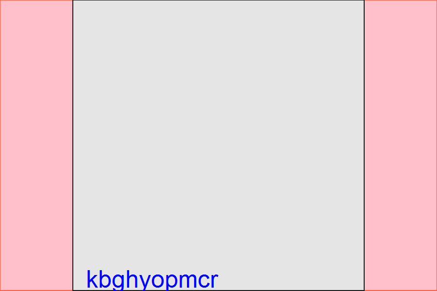

<!--
%\VignetteEngine{knitr::knitr}
%\VignetteIndexEntry{Code Behind Vignette}
-->

# Goals of this Package
This vignette is a minimal example of an R package that has a nonstandard vignette.  I would like to have a working example of a vignette with these features: 
 1. Is built with `knitr` instead of `Sweave`.  
 1. Uses `knitr`'s [code externalization](http://yihui.name/knitr/demo/externalization/) feature, where almost all the R code lives in a dedicated *.R file.
 1. Is **not** rebuilt every time the package is checked.  I am pretending this vignette takes a long time to run and compile, and should be run on CRAN or win-builder computer (or even run on the developer's computer is they don't want to take 5+ minutes)
 1. Saves images to a dedicated directory to make it easier to track changes in GitHub.  Presumably this directory is `./vignettes/FigureRmd`.

I chose an Rmd file instead of a Rnw, so that it could be more portable and run on more development boxes, and increase the chance of getting a more helpful response.  If these two types of files handles things differently, I'll add an Rnw example.

I am intentionally not using knitr's caching mechanism, in case it makes package development and portability trickier.


## Declare Global Variables

```r
durationInSeconds <- 1.3
```


## Analysis 1

```r
a1 <- RVignetteExample::ComplicatedFunction(durationInSeconds)
print(a1)
```

```
[1] "eciwylrzqu"
```


## Analysis 2

```r
a2 <- RVignetteExample::ComplicatedFunction(durationInSeconds)
print(a2)
```

```
[1] "glaikreucn"
```


## Graph 1

```r
graphics::plot(x=1:10, y=10:1)
graphics::text(x=1:10, y=1:10, labels=a1)
```


## Graph 2

```r
grid::grid.newpage()
grid::pushViewport(grid::viewport(layout=grid::grid.layout(nrow=1, ncol=1, respect=T)))
grid::grid.rect(gp=grid::gpar(fill="pink", col="tomato")) 
grid::pushViewport(grid::viewport(layout.pos.col=1, layout.pos.row=1)) 
grid::grid.rect(gp=grid::gpar(fill="gray90", col="gray10")) 
grid::grid.text(a2, x=0, y=0, hjust=-.1, vjust=-.2, gp=grid::gpar(cex=1.5, col="blue", lineheight=.8, fill="tan1"), default.units="npc")
grid::popViewport(2)
```




## Session Info
The current vignette was build on a system using the following software.


```
Report created by Will at 12/27/2013 6:08:51 PM, Central Standard Time
```

```
R version 3.0.2 Patched (2013-12-17 r64473)
Platform: x86_64-w64-mingw32/x64 (64-bit)

locale:
[1] LC_COLLATE=English_United States.1252  LC_CTYPE=English_United States.1252    LC_MONETARY=English_United States.1252
[4] LC_NUMERIC=C                           LC_TIME=English_United States.1252    

attached base packages:
[1] stats     graphics  grDevices utils     datasets  methods   base     

other attached packages:
[1] knitr_1.5

loaded via a namespace (and not attached):
[1] evaluate_0.5.1       formatR_0.10         grid_3.0.2           RVignetteExample_0.1 stringr_0.6.2       
[6] testit_0.3           tools_3.0.2         
```

